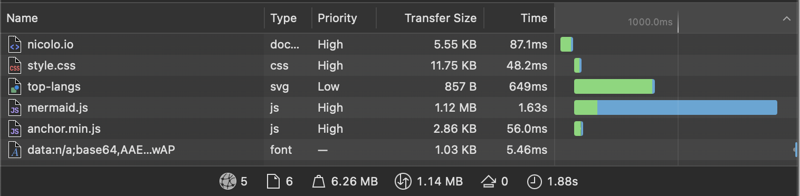
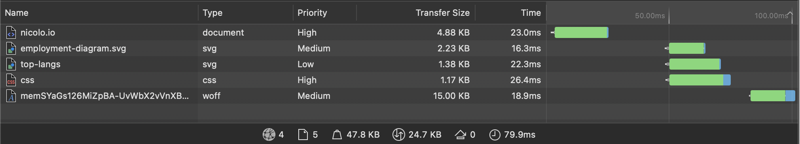
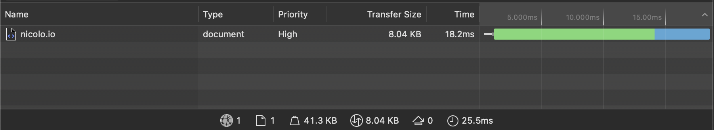
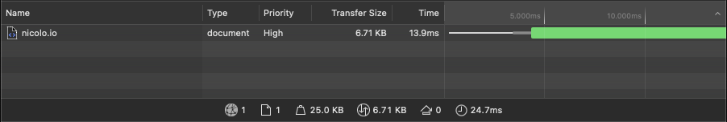

# Making a fast website

## Introduction

> For a large segment of internet users, waiting for a page that may never fully load breaks the promise of the internet even to the point of putting lives at risk during emergencies.
>
> A lot of energy is used to power data centers and the devices they serve. We can help reduce overall energy demands by keeping our file payloads smaller which also keeps payload transmission faster and more efficient.

> <cite>https://almanac.httparchive.org/en/2021/page-weight</cite>

The internet has become heavier and heavier over the years. Developers pulling in random libraries and frameworks and not caring about the end user needing to download all that data. We need to return to simplicity.

With this as my guiding principle, I set out to make my [personal website](https://nicolo.se) as light as possible - without sacrificing on the aesthetics. I will be sharing my journey and the tools I used to achieve this goal.

**Disclaimer**: This blog is not optimized in any way yet. I am no role model (yet). I am just taking small steps to make it better.

## The journey

At the moment my website serves one purpose. It hosts my CV. My ambition is not to make it look flashy with a lot of moving content. I am fond of the idea of simple websites that focus on the content. Preferably, and as mine is at the moment, they should have no javascript at all.

### My markdown website

I host my website on github pages. They provide a free hosting service for static websites with very fast load times. They have support for markdown websites. You just write everything in a file called `index.md` and github will render it for you. This is what I used this for a while, because it was super easy to get started. No need to worry about hosting, or setting up a build pipeline. I could just focus on writing.

The images that I am going to show below are form the "network tab" in the developer tools. They show the sequence of requests made to the content providers.

This is what my website looked like back then.

**Initial**

As you can see there are a lot of request being made. Comparing it to [page-weight statistics](https://httparchive.org/reports/page-weight) from the httparchive it wasn't that heavy to begin with. The only issue is that there was not a lot of content on the website to justify the 1M size.
This was mainly due to `mermaid.js`. This one library was about 200 times heavier than the actual content itself. It is a library used to convert [mermaid.js](https://mermaid.js.org) diagrams to SVG on the client.

I noticed that the mermaid library that I was using was not minified. Looking around I managed to find a minified version of the library. This is what it looked like after minification.

**Minified Mermaid**

This managed to reduce the size of the library a bit, but there was still a lot of room for improvement.

This is when I decided to go for a more custom solution.

### HTML and CSS (and SVG)

I realized that if I wanted to become **fast** I needed to ditch github's markdown renderer.

The website was rewritten in HTML and CSS. I also decided to pre-render the mermaid diagrams to SVG. This way I could just include the SVG in the HTML and not have to worry about the client needing to download the whole library and rendering the diagram.

**HTML and SVGs**

This was the biggest improvement in performance that I made. Now the whole website weighted about 25kb. The size was reduced 50 fold.

During the conversion to HTML I pulled in Open Sans from google fonts to replace the one github uses for their markdown. Open Sans is the last request being made in the image above. This extended the load by about 25ms at best. Because first it loaded in a css file, which then downloaded the font.
I tried first hosting the fonts together with the other files. Which removed the extra fetching of the css file, but now the font was many times heavier than before. As can be seen in the image below, the font request has a large portion of the bar that is blue, meaning that it is spending almost half the time downloading.

**Local Font**

I ended up styling a web-safe font to look like Open Sans. This way I could get rid of the extra request and can celebrate a boot in performance.

**No font**

The website size had decrease to 8kb! A 150 fold improvement from the start. However, the total load time was the same because there were still a lot of different requests being made.

At time point, the website is basically a html file that loads in two svg. A nice thing about SVGs is that they can be inlined. Meaning that everything can be bundled into a single file. This is what I did next.

**Final (?)**

After manually inlining the SVGs, the website is now a single html file!

The journey could end here. I was happy with the result. However, I wanted to see if I could do better.

## Using Astro

Initially I did not want to use any frameworks. I wanted to keep it as close to vanilla as possible. My requirements were simple:

- No: shipping any javascript if the website wasn't interactive.
- No: a runtime
- Yes: Server side rendering (SSR)
- Yes: reusable components without the need for javascript
- Yes: markdown support (future blog?)

This rules out the majority of javascript frameworks I knew of. However, [Astro](https://astro.build) looked like a good fit. It is a static site generator that uses [snowpack](https://www.snowpack.dev/) under the hood. It also has support for markdown and SSR. I decided to give it a try.

Converting the website from plain html to Astro was pretty straight forward. It was just a matter of factoring out the common parts into components and I was done.

A problem that I ran into was that building using Astro generated a directory that contained:

- index.html
- subdirectory with css files
- SVG files

This was not ideal, it would be going back to how it was before.
To remedy this I added a [script](https://github.com/ridulfo/nicolo.se/blob/main/inline-styles.mjs) that at build time would inline all the css and svg files into the html file. A nice feature was that it also minified everything making the final index.html smaller!

**Astro**

The website was actually smaller after adding the framework (mostly thanks to the minifier).

Note, using Astro can result in more boiler plate in the final build if the developer is not careful. For example, generously using layout components that contain one or more divs can result in an exponential increase in the amount of divs in the final html.

## Conclusion

We can safely say that **any** client with using a recent browser can load this website without any issues. Even time travelers with a 56k modem can load it in under one second.

By just taking a little bit of care and doing some optimizations it can make a huge difference in performance. This, without any impact on design, everything looks the same.

This website is a candidate for the [10kb club](https://10kbclub.com/).

### Addendum 2025-08-18

Since this post was published I have changed to a more traditional, cache friendly solution that does not explicitly inline all css and assets into the documents. 
For the css, Astro is smart enough to only inline css if it is small enough (<cite>Source: <a href="https://docs.astro.build/en/guides/styling/#bundle-control">Astro Docs</a> 2025-08-18</cite>).
For the assets, Astro adds the `loading=lazy` property to the `img` tags, making the browser only download them as you are about to scroll them into view, further saving bandwidth. This simplified the building and deploying of this site.
