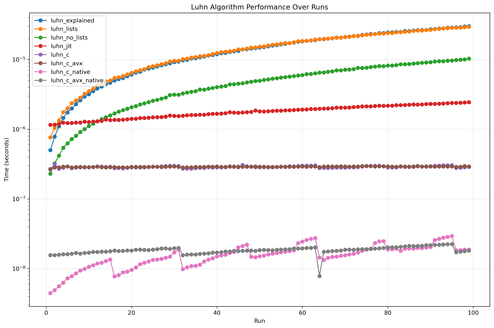
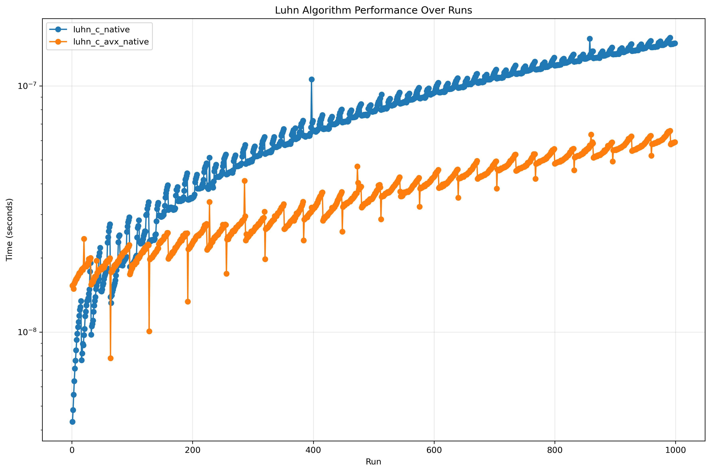
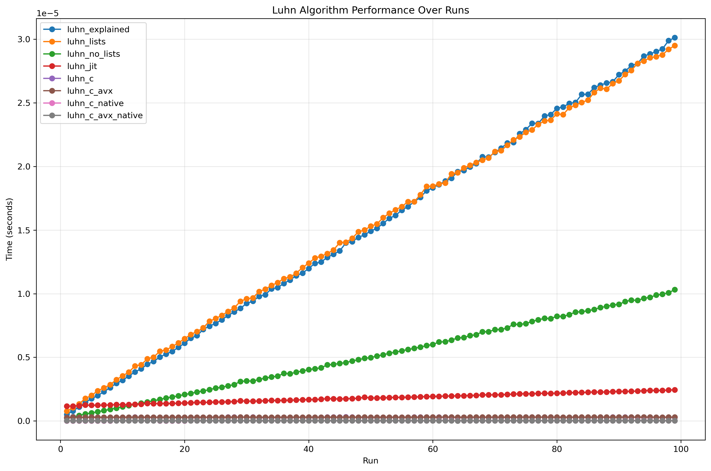
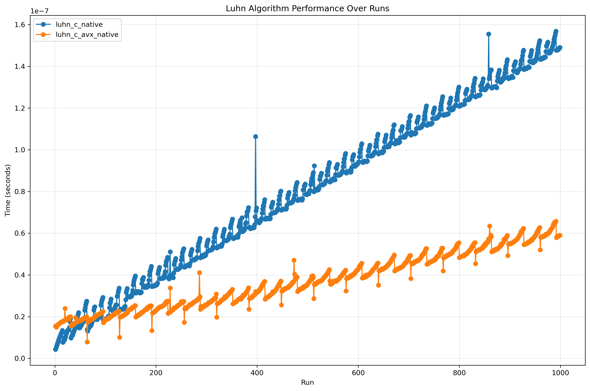

# Optimizing Luhn's algorithm

## Introduction
As a fun educational exercise, I decided to try and see how fast I could make a [check digit](https://en.wikipedia.org/wiki/Check_digit) algorithm go. The first one that popped into my head was [Luhn's algorithm](https://en.wikipedia.org/wiki/Luhn_algorithm); a simple, yet widely used algorithm for checking that sequences of digits do contain mistakes. In Sweden, the last digit of our social security numbers (SSNs) are computed using this algorithm. Internationally, it is probably most famous for its role in making sure that credit card numbers haven't been entered incorrectly. [Here is a list of other places where it pops up](https://en.wikipedia.org/wiki/Luhn_algorithm#Uses).

This post recounts the step by step journey of optimizing the implementation of this algorithm to make it run as fast as possible. We'll be focusing more on trying and comparing different technologies, rather than exploring how the algorithm can be reengineered.

### Overview of implementations
- Simple canonical implementation (python)
- Functional style (python)
- No lists (python)
- Just-in-time compilation (python + numba)
- Low-level (C)
- Vectorized (C + AVX)

### Benchmark
A benchmarking script was written to generate `n` strings of `m` digits that resemble Swedish SSNs (personnummer). Each implementation will first be benchmarked using `n=1000` and `m=11`, and at the end the implementations will be compared with increasing values of `m`.

The following benchmarks were run on my AMD Ryzen AI 7 350. This is the same machine as mentioned in the post [Framework Laptop Part 1](https://nicolo.se/writing/2025-08-16-framework-laptop.html).

## Luhn's Algorithm
The algorithm is simple and is usually performed in the following way.

Fake SSN: 19260330-270X (YYYYMMDD-WWWX)
X = check digit

1. Start from the right and double every second digit
```
   1  9  2  6  0  3  3  0  2  7  0
×  1  2  1  2  1  2  1  2  1  2  1
=  1 18  2 12  0  6  3  0  2 14  0
```

2. Sum the tens and unit digits (splitting two-digit numbers)
```
   1 18  2 12  0  6  3  0  2 14  0
=> 1  9  2  3  0  6  3  0  2  5  0
```

3. Sum all digits
```
S = 1+9+2+3+0+6+3+0+2+5+0 = 31
```

4. Apply the formula `(10 - (S mod 10)) mod 10`
```
(10 - (31 mod 10)) mod 10 = (10 - 1) mod 10 = 9
```

In python that would look like this:
```python
def luhn_explained(ssn: str) -> int:
    # Start from the right (by reversing the list)
    ssn = reversed(ssn)

    total = 0
    for i, s in enumerate(ssn): # Double every second digit
        factor = 2 if i % 2 == 0 else 1
        product = factor * int(s)

        # Extract the digits (e.g. 12 -> ["1", "2"])
        digits = list(str(product))

        # Turn them back into integers, sum
        # them and add them to the total
        total += sum(map(int, digits))

    # Apply the formula
    return (10 - (total % 10)) % 10
```

### The type of `ssn`
You might have noticed that the type of the parameter `ssn` is `str`. This is done intentionally as the Swedish Tax Agency specifies in [skv704-8.pdf](https://docs.swedenconnect.se/technical-framework/mirror/skv/skv704-8.pdf) that social security numbers are to be treated as strings. The reason being that in the abbreviated form (YYMMDD-WWWX) they can have leading zeros and they might contain `+` and `-`. In this post, we'll use the format `YYYYMMDDWWW`, and so the type could have been a number as well. However, using strings is truer to how they are stored in the real world.

## Version 1: `luhn_explained` 
We'll call the version above `luhn_explained`. Benchmarking this implementation on 11 digit social security numbers we get an average time of `3.448 μs` per call. 

## Version 2: `luhn_lists`
In python, list comprehension is usually faster than the equivalent for-loop + append as seen by the following micro-benchmark:

```python
data = list(range(10000))

def for_loop_double():
    result = []
    for x in data:
        result.append(x * 2)
    return result

def list_comp_double():
    return [x * 2 for x in data]
```

Calling the functions above 1000 times each using [timeit](https://docs.python.org/3/library/timeit.html) resulted in the following.

```
For loop: 0.4267s        
List comp: 0.3666s
List comp is 1.16x faster
```

The hypothesis is therefore that using list comprehension must lead to a performance improvement. This version could also have been seen as the functional approach, as nothing is mutated (if you allow for [shadowing](https://en.wikipedia.org/wiki/Variable_shadowing)).

```python
def luhn_lists(ssn1: str) -> int:
    length = len(ssn1)
    ssn2 = reversed(ssn1)
    factors = [2 if i % 2 == 0 else 1 for i in range(length)]
    products = [f * int(s) for f, s in zip(factors, ssn2)]
    total = sum([sum(map(int, list(str(p)))) for p in products])

    return (10 - (total % 10)) % 10
```

The hypothesis did not hold. The culprit is probably all the memory allocations being made. This version resulted in `3.921 μs` per call (higher than version 1!).

## Version 3: `luhn_no_lists`
Lists probably being the reason for the previous implementation being slower than the first one, this approach did away with all lists and only used iterators.

```python
def luhn_no_lists(ssn: str) -> int:
    ssn = reversed(ssn)
    total = 0
    for i, s in enumerate(ssn):
        factor = 2 if i % 2 == 0 else 1
        product = factor * int(s)
        total += product // 10
        total += product % 10
    return (10 - (total % 10)) % 10
```

Only two generators are created to help iterate over the digits. This implementation succeeded in improving over the first version by 2.88 times with a per call time of `1.197 μs`.

## Version 4: `luhn_jit`
Just-in-time (JIT) compilation is when an interpreted or virtual machine language compiles parts of the code into native executable code. This is often done to code that is executed a lot of times such as hot-loops, and therefore often results in faster running programs. CPython, the most common implementation of python, actually added a built-in JIT compiler in version 3.13. However, it isn't enabled by default and needs to be done when building the CPython interpreter by passing `-enable-experimental-jit` to the configure script. Attempts were made to locally build such a version of python, but it was [broken on NixOS](https://github.com/NixOS/nixpkgs/issues/331764) at the time of writing. There are two other famous projects to JIT compile python: [numba](https://numba.pydata.org/) and [pypy](https://pypy.org/). The following code uses numba.

```python
@numba.njit # <-- Added this
def luhn_jit(ssn: str) -> int:
    ssn = ssn[::-1] # change: reverse is not supported
    total = 0
    for i, s in enumerate(ssn):
        factor = 2 if i % 2 == 0 else 1
        product = factor * (ord(s) - ord("0")) # change: int() is not allowed
        total += product // 10
        total += product % 10
    return (10 - (total % 10)) % 10
```

Usually, when adding `njit`, you are immediately rewarded with a massive performance improvement as can be seen here [Sudoku Implementations](https://github.com/ridulfo/sudoku-implementations?tab=readme-ov-file#performance). However, in this case we get a disappointing `1.219 μs` per call. This is slower than the no lists implementation. The issue probably lies in the overhead of switching into the JIT compiled code which cancels out the performance improvements.

It should be noted that for the JIT implementation to have a fair trial, it was run a few times before being benchmarked in order to be sure that Numba had compiled the function.

## Version 5: Low-level
So far, all the code has been written in python. Great for readability and portability, not great for performance optimization. To move into the next performance regime, we need to switch to a lower level language. `C` is the perfect choice for this as python has great interoperation with `C`.

```c
uint8_t luhn(char *ssn) {
  size_t ssn_length = strlen(ssn);
  uint8_t total = 0;

  for (size_t i = 0; i < ssn_length; i++) {
    uint8_t digit = ssn[ssn_length - 1 - i] - '0';
    uint8_t factor = (i % 2 == 0) ? 2 : 1;
    uint8_t product = factor * digit;

    total += product / 10;
    total += product % 10;
  }

  return (10 - (total % 10)) % 10;
}
```

Fortunately, this code is still pretty readable and easy to follow. Now, to be able to call this code from python a few steps need to be performed. First, a shared library needs to be compiled using maximum optimizations.

```bash
gcc -shared -fPIC -O3 -o luhn/libluhn.so luhn/impl.c
```

The `-fPIC` flag is used to make the library code "position independent", which is needed to make it work as a shared library. The `-O3` flag tells the compiler to optimize aggressively. Later, we'll be adding these flags `-mavx512f -mavx512dq -mavx512bw -mavx512vl -march=native -mtune=native` to enable [AVX](https://en.wikipedia.org/wiki/Advanced_Vector_Extensions) which will be used in the final vectorized implementation.

Then, on the python side, the shared library needs to be loaded and wrapped in python code.

```python
dll_path = pathlib.Path(__file__).parent.resolve() / "libluhn.so"
lib = ctypes.CDLL(dll_path)
lib.luhn.argtypes = [ctypes.c_char_p]
lib.luhn.restype = ctypes.c_int8

def luhn_c(ssn_str):
    return lib.luhn(ssn_str.encode("utf-8"))
```

8-bit integers were used for the return type as the return value (the check digit) will never exceed 9.

This version crushes all the python implementations by a long shot timing in at `0.279 μs`, making it 12.36 times faster than the original implementation.

## Version 6: vectorize
A sure way to speed up data processing is to leverage Single Instruction Multiple Data (SIMD) operations. These essentially apply the same instruction (e.g. add, subtract, etc.) to multiple pieces of data at the same time. Today, most CPUs have some sort of SIMD instructions. Historically, you have been able to find SIMD on x86 processors as far back as 1995 with the introduction of [MMX](https://en.wikipedia.org/wiki/MMX_(instruction_set)). This extension sported 64-bit registers, today that is the standard [word size](https://en.wikipedia.org/wiki/Word_(computer_architecture)). In 2016, Intel introduced Advanced Vector Extension 512 (AVX-512) which had 512-bit registers. On the ARM side, [NEON](https://en.wikipedia.org/wiki/ARM_architecture_family#Advanced_SIMD_(Neon)) supports 128-bit registers, with some high end CPUs having Scalable Vector Extension (SVE) with an upper limit of 2048-bit registers.

My CPU is of the Zen 5 architecture and therefore supports up to AVX-512. The following is a SIMD optimized implementation of Luhn's algorithm. I will admit that I didn't write this all by myself. An LLM was used to help me when I got stuck.

```c
__attribute__((target("avx512f,avx512bw"))) uint8_t luhn_avx(char *ssn) {
  size_t ssn_length = strlen(ssn);

  uint32_t total = 0;
  for (size_t chunk_start = 0; chunk_start < ssn_length; chunk_start += 64) {
    size_t chunk_size =
        (ssn_length - chunk_start > 64) ? 64 : (ssn_length - chunk_start);

    // Copy the digits into a new buffer
    uint8_t data[64] __attribute__((aligned(64))) = {0};
    for (size_t i = 0; i < chunk_size; i++) {
      size_t src_idx = ssn_length - 1 - (chunk_start + i);
      data[i] = ssn[src_idx] - '0';
    }

    // Load the buffer into a 512-bit vector
    __m512i digits = _mm512_load_si512((__m512i *)data);

    // Create a new vector that is the double of the one above
    __m512i doubled = _mm512_add_epi8(digits, digits);

    // To compute the sum of the tens and unit digits, `9` is subtracted from
    // the products that are greater than `9`.
    // E.g. `7 doubled = 14 --> 14-9=5 <=> 1+4`
    __mmask64 ge10_mask = _mm512_cmpgt_epi8_mask(doubled, _mm512_set1_epi8(9));
    __m512i correction =
        _mm512_mask_set1_epi8(_mm512_setzero_si512(), ge10_mask, 9);
    __m512i even_result = _mm512_sub_epi8(doubled, correction);

    // To only double every other digit, a mask is created.
    // 0xA = 1010. Each bit in the mask corresponds to a byte in the vector that
    // the mask is applied to.
    __mmask64 alternating_mask = 0xAAAAAAAAAAAAAAAAULL;

    // Apply the mask
    __m512i final_result =
        _mm512_mask_blend_epi8(alternating_mask, even_result, digits);

    // There is no function to sum and store the result into a single variable.
    // The best that can be done is to store the sum in eight `uint64_t`s.
    __m512i sum = _mm512_sad_epu8(final_result, _mm512_setzero_si512());
    uint64_t partial_sums[8];
    _mm512_store_si512((__m512i *)partial_sums, sum);

    uint32_t partial_total =
        partial_sums[0] + partial_sums[1] + partial_sums[2] + partial_sums[3] +
        partial_sums[4] + partial_sums[5] + partial_sums[6] + partial_sums[7];

    total += partial_total;
  }

  return (10 - (total % 10)) % 10;
}
```

The clever part of this algorithm is realizing that for numbers between 10 and 19, the sum of the tens and units digits is the same thing as subtracting nine. This lends itself well to vectorization.

A technique that is used a lot in the code above is masking. This is when you use one vector to decide which elements of another vector are going to have an instruction applied to it. For example the following lines show how two vectors are merged into one, alternating values from each of the vectors.

```c
__mmask64 alternating_mask = 0xAAAAAAAAAAAAAAAAULL;

__m512i final_result =
_mm512_mask_blend_epi8(alternating_mask, even_result, digits);
```

The `alternating_mask`'s string of `A`s works out to `1010101010101010...` in binary. Applying this mask to `even_result` and `digits`, first a value is picked from `even_result`, then one is picked from `digits` and so on. The resulting vector is an alternating merge of the two input vectors.

This implementation does not really improve on the average call time with only `0.284 μs` per call. It looks as if the bottleneck for the C implementations might not be the C code, but rather the Python-C interoperation.

## Benchmarking the C versions using C
An equivalent benchmarking program was created in C. Unsurprisingly, the results show orders of magnitude improvements compared to the wrapped C code. Here the average call took `0.011 μs` for the first C implementation and the SIMD one taking `0.016 μs`. We can see that the SIMD version is actually slower than the standard scalar version. However, we'll see that as `m` increases, the SIMD wins out in the end.

## Comparing all of them
Finally, all versions are benchmarked against each other. The diagrams below show `m` vs call duration, where the duration is plotted on a logarithmic scale.


*Comparison of all implementations (log)*

It is easy to see that the implementations can be clustered into the following categories:
- The implementations that allocate too much
- Doesn't allocate, but still relatively slow
- Just-in-time compiled
- C wrapped in python
- Native C

All the pure python ones are fast initially, as there isn't any switching overhead. As can be seen in the initial `m=11` benchmarks, the JIT compiled implementation was slow at first, but then doesn't increase that much as `m` increases. This is because you have to pay a constant price for switching to the JIT code. Therefore, it can be concluded that to utilize JIT to its fullest, it is recommended to have longer running functions. Similarly, the python wrapped C implementations are essentially only paying for the stepping in and out of C because the native C implementation takes a negligible amount of time.

The native C implementations exhibit some interesting patterns. The plain C implementation seems to get faster every 16 steps. The reason for this is probably [loop unrolling](https://en.wikipedia.org/wiki/Loop_unrolling). Essentially, the compiler generated several versions of the compiled code, some unrolled and with loops. Then at runtime, it decides which version to use. The AVX implementation sees a sharp drop (speed increase) when `m=64`. The exact reason for this is hard to say without doing further investigations, but likely factors are: the string fitting in a cache line and/or the string fitting exactly in the 512-bit register.
One improvement to the C implementations would be to pass the length of the string as a parameter. As opposed to python, C strings do not contain their length. Therefore, `strlen` needs to iterate over all values until it hits a `\0` (null value). Benchmarking this is left as an exercise to the reader.

The first diagram seemed to indicate that, although the regular C implementation performed better in the beginning, the SIMD implementation slowly overtook it as `m` got bigger. To investigate this, only the C native implementations were run up to `m=1000`.


*Comparison of only the C implementations (log)*

As theorized, the SIMD implementation overtook the regular implementation and proceeded to increase at a slower rate.

Finally, for effect and to illustrate the scale of improvements between the different algorithms, they were plotted using a normal Y-axis instead of a log one.


*Comparison of all implementations*

*Comparison of only the C implementations*

There are many possible improvements that can be made to each one of the algorithms, but this is where this small investigation ends.

All code can be found at [Luhn Implementations](https://github.com/ridulfo/luhn-implementations).
